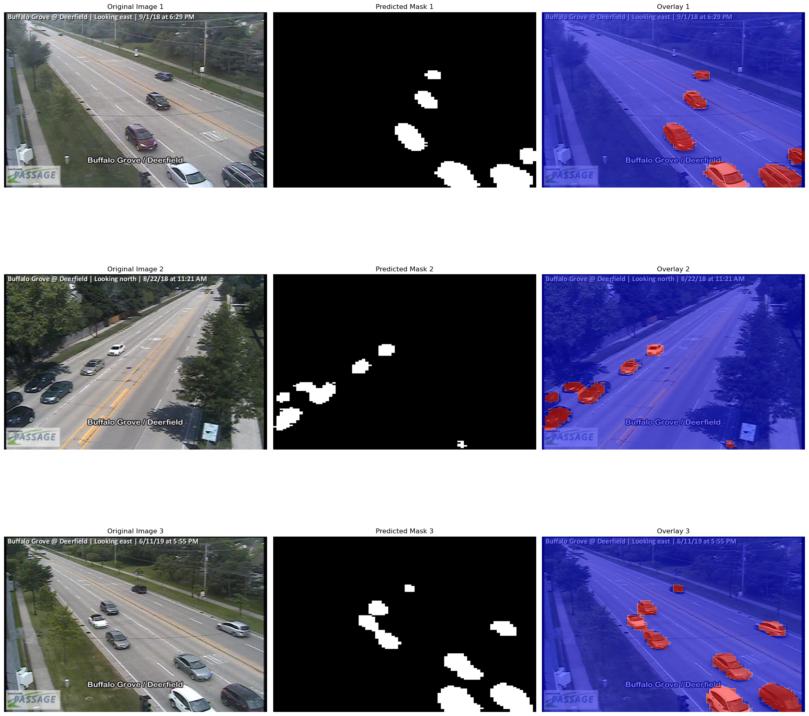
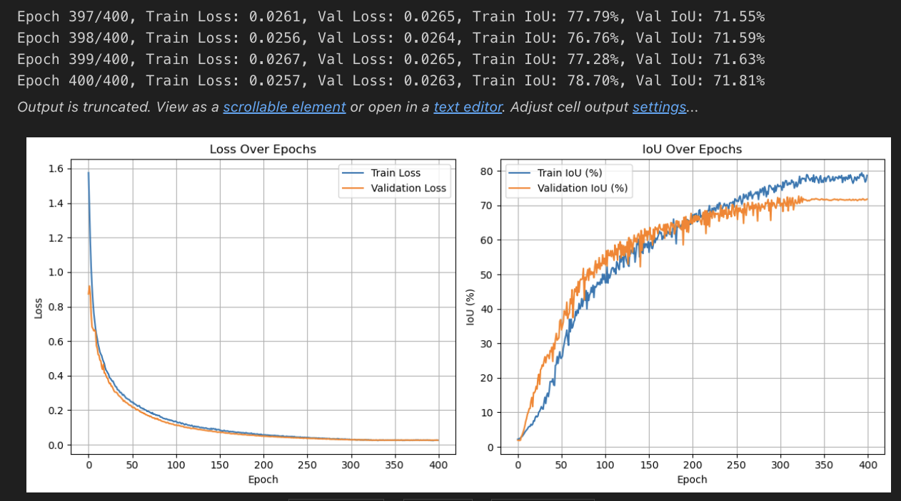

# Semantic-Image-Segmentation-model

# Background-Foreground Separation (BFS) using Deep Learning  

## Overview  
This project implements a **semantic segmentation model** using **PyTorch** to separate foreground objects (vehicles, pedestrians) from background in traffic camera images. The model is trained on a dataset of urban traffic scenes and aims to improve **background-foreground separation (BFS)** through deep learning techniques.  

## Features  
- Custom **PyTorch Dataset** class for structured data loading  
- **UNet-based** deep learning model for pixel-wise segmentation  
- **IoU (Intersection over Union) evaluation** for performance assessment  
- Optimized training with **AdamW optimizer** and **ReduceLROnPlateau scheduler**  
- **Visualization tools** to display predictions overlaid on original images  

## Dataset  
- Contains images from suburban traffic cameras in Chicago, IL  
- **Annotation masks** highlight foreground objects (vehicles, pedestrians)  
- Images are resized for **faster training and inference**  

## Model Architecture  
- **UNet-inspired** architecture for **semantic segmentation**  
- Encoder with **convolutional layers, batch normalization, and dropout**  
- Decoder with **transposed convolutions for upsampling**  
- **Sigmoid activation** to produce probability masks  

## Training & Evaluation  
- **Binary Cross-Entropy Loss (BCELoss)** for training  
- **IoU (Intersection over Union) as primary metric**  
- **Training pipeline** supports GPU and CPU execution  
- **400 epochs with dynamic learning rate adjustment**  

## Inference & Visualization  
- Predicts segmentation masks on new traffic camera images  
- Outputs **original images, binary masks, and overlayed predictions**  

### **Example Model Predictions**  

### **Training Metrics**  

